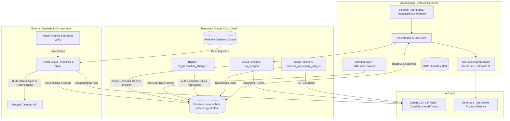

# Fortuna — A Hybrid Cloud + On-Device AI Financial Ecosystem

  <b>🇺🇸 English</b> |
  <a href="README.pt-BR.md">🇧🇷 Português</a>

---

**Case study.** Fortuna is a personal financial assistant and automation ecosystem I built to explore a critical question in modern systems engineering: *what belongs in a cloud LLM, and what should run on the device itself?* It operates an AI agent across **both** — Gemini in the cloud and Gemma on-device via MediaPipe/LiteRT — inside a production-grade Android application backed by an event-driven serverless pipeline and automated reconciliation workflows.

> The application code and data are private (it manages my own financial operations). This repository documents the architecture, system design, and engineering decisions. **Live demo available on request.**

---

## 💡 Why it's interesting

Most "AI apps" are thin wrappers around a single API call to a hosted LLM. Fortuna is a **complete end-to-end distributed system**:

- 📱 a **mobile client** (Kotlin, Jetpack Compose, Feature-First Clean Architecture, Room SQLite) capable of seamlessly routing prompts between on-device local models and cloud endpoints.
- ⚡ a **cloud agent (`run_myagent`)** with Pydantic-validated structured outputs, asynchronous Firestore data assembly, and proactive cached insights.
- 🤖 an **on-device LLM (Gemma 3)** running locally via MediaPipe for zero-latency, private financial queries without network connectivity.
- ⏰ **background proactive automation** utilizing **Android WorkManager** for scheduled bill alerts and Prefect flows for bidirectional **Google Calendar** sync and payment reconciliation.
- 📊 an **event-driven data backbone** that guarantees transactional consistency across Firestore reports in under a second upon new transaction ingestion.
- 📈 an **investment tracking & OCR engine** combining multimodal Gemini extraction of PDF statements with real-time market data (B3 & Crypto).

---

## 🏗️ System Architecture

---

## 🧠 How the Multi-Tier AI Layer Works

### 1. Cloud Agent (`run_myagent`)
A Python Gen2 Cloud Function gathers 2 months of transactional context, category budget limits, and upcoming scheduled obligations. Using Pydantic schemas and Gemini Structured Outputs (`application/json`), it returns:
* A typed chat answer.
* An array of actionable, proactive financial insight cards.
* Automated tool-call detection for actions like investment registrations.
Insights are cached in `users/{userId}/agent/state` for instantaneous cold starts on mobile.

### 2. On-Device Local LLM (`OnDeviceAgentService`)
Using MediaPipe’s `LlmInference` engine, the mobile app loads a 4-bit quantized **Gemma 3** model directly into device RAM. It processes budget summaries and prompt context strictly on CPU/GPU without sending sensitive financial telemetry outside the phone.

### 3. Multimodal Document OCR (`process_investment_pdf_ocr`)
Users upload investment statement PDFs via Cloud Storage. The system triggers Gemini Flash to parse messy broker reports, extracting transactions (`APLICACAO`, `RESGATE`, `RENDIMENTO`), and automatically updates asset balances and Google Sheets backups.

---

## 📱 Application Screens & User Experience (UI/UX)

The mobile UI is built 100% in **Jetpack Compose** using declarative stack navigation (`AppNavigation.kt`), structured across 5 functional pillars:

### 1. AI Assistant & Insights (`AgentScreen`)
* **Proactive Insight Cards:** Actionable budget alerts and spending anomalies surfaced by AI.
* **Inference Mode Toggle:** Instant switching between private On-Device (offline Gemma) and Cloud (Gemini).
* **Interactive Chat:** Full conversational history with structured rendering of suggested actions.

### 2. Scheduled Obligations & Reconciliation (`BillsScreen`)
* **Bills Overview:** Visual separation between *Pending* and *Paid* bills synchronized from Google Calendar (`scheduled_bills`).
* **Auto-Reconciliation Engine:** Interface to inspect and configure regex/matching rules (`bill_mappings`) connecting bank charges to scheduled bills.
* **WorkManager Alerts:** Daily background notifications for upcoming due dates.

### 3. Expense Analytics & Transaction Explorer
* **Monthly Overview (`MonthlyReportScreen`):** Net cash flow, average ticket, category breakdown charts, and top expenses.
* **Monthly Transactions Explorer (`MonthlyTransactionsScreen`):** Full searchable table of monthly charges with real-time text filtering and chronological sorting.
* **Category Drill-Down (`CategoryTransactionsScreen`):** Deep dive into specific category expenses with cumulative totals.

### 4. Investment Portfolio & Document OCR (`InvestmentScreen`)
* **Asset Allocation:** Consolidated net worth tracking across Fixed Income, Equities (B3), Real Estate Funds (FIIs), and Crypto.
* **Financial Milestones:** Tracking progress against short and long-term financial goals.
* **Statement OCR:** One-click PDF upload triggering Gemini Flash automated statement ingestion.

### 5. Settings & Data Governance
* **Budget Limits (`BudgetLimitsScreen`):** Category-level thresholds used by the AI agent to flag budget overruns.
* **Push Notification Logs (`NotificationListScreen`):** Live stream of captured transactions with synchronization flags (`synced`).
* **Package Filters (`FilterListScreen`):** Granular controls configuring which banking apps are intercepted by `NotificationListenerService`.

---

## 🖼️ Screen Gallery

> Screenshots from the production app running on live data (third-party identifying information redacted).

| Agent Home (Proactive AI) | Monthly Summary & Aggregates | Scheduled Bills & Calendar |
|---|---|---|
|  |  |  |
| Proactive AI cards + **Cloud / On-Device** toggle | Real-time consolidated spend by category | Calendar sync and auto-reconciliation rules |

| Monthly Transactions Explorer | Investment Portfolio & OCR | Budget & Category Limits |
|---|---|---|
|  |  |  |
| Search by merchant name & chronological sort | Multi-asset net worth & PDF statement OCR | Dynamic thresholds feeding the AI agent |

| Push Ingestion & Filters | Agent Hub & Navigation |
|---|---|
|  |  |
| Monitored banking applications | Central navigation and prompt configuration |

---

## ⚙️ Key Engineering Decisions

* **Edge + Cloud Hybrid Design:** Heavy analytical jobs and OCR live in the cloud; private, latency-critical inquiries and daily local notifications live on the client.
* **Strict Spec-Driven Development (SDD):** Firestore models, NoSQL collection schemas, and reconciliation heuristics are documented and enforced via a Single Source of Truth (SSOT).
* **Automated Calendar & Statement Reconciliation:** Financial debits are automatically matched against scheduled calendar entries using date tolerance windows and fuzzy name matching, auto-marking bills as `[PAGO]` in Google Calendar.
* **Hermetic End-to-End Testing:** Backend and pipeline updates are validated using automated emulator harnesses (`Firebase Emulator + Prefect Server`) before deployment to production.
* **Deterministic Transaction Hashing:** Transactions use MD5 hashes of `date + time + amount + establishment` as document IDs to eliminate duplicates across push retries.

---

## 🛠️ Tech Stack

* **Mobile (Android):** Kotlin, Jetpack Compose, Clean Architecture (Feature-First), Room (SQLite), WorkManager, MediaPipe GenAI / LiteRT, Gemma 3.
* **Backend & Cloud Functions:** Python 3.12, Google Cloud Functions (Gen2 / Cloud Run), Firebase Admin SDK, Pydantic, Gemini Flash.
* **Orchestration & Data Pipelines:** Prefect Cloud / Server, Google Calendar API, Google Sheets API (`gspread`), `yfinance`, Binance API.
* **Databases:** Cloud Firestore (NoSQL), Firebase Realtime Database (event queue).

---

## 🎥 Live Demo & Presentation

A comprehensive walkthrough video demonstrating:
* Live push interception and real-time Firestore aggregation.
* Seamless switching between **Cloud Gemini** and **On-Device Gemma 3**.
* Scheduled bills management with background WorkManager reminders.

*Available on request — feel free to connect via [LinkedIn](https://www.linkedin.com/in/rogeriocs/).*

---

*Engineered by [Rogério Celestino](https://rogerioc.github.io/about/) — Senior Software Engineer focused on Applied AI & Distributed Systems.*
