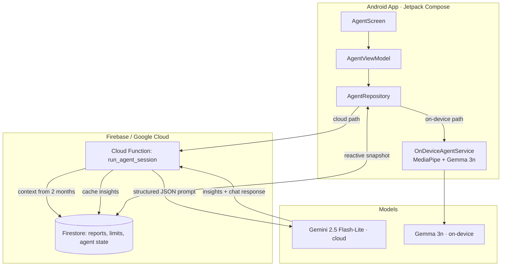

# Fortuna — A Hybrid Cloud + On-Device AI Assistant

**Case study.** Fortuna is a personal financial assistant I built to explore a question most teams aren't tackling yet: *what belongs in a cloud LLM, and what should run on the device itself?* It runs an AI agent across **both** — Gemini in the cloud and Gemma on-device via MediaPipe — inside a real Android app backed by an event-driven serverless pipeline.

> The application code and data are private (it runs on my own financial data). This repository documents the architecture and engineering decisions. **Live demo available on request.**

---

## Why it's interesting

Most "LLM app" projects are a single API call to a hosted model. Fortuna is a **full system**:

- a **mobile client** (Jetpack Compose, Clean Architecture) that can talk to either a cloud or an on-device model,
- a **cloud agent** that assembles user context, calls an LLM with structured outputs, and caches proactive insights,
- an **event-driven data backend** that keeps everything consistent in under a second,
- and an **orchestration layer** for the batch/analytical jobs.

It's the combination — mobile + LLM orchestration + data engineering + on-device inference — that makes it a real Applied-AI system rather than a demo.

---

## Architecture

---

## How the AI layer works

**Cloud agent (`run_agent_session`).** A Python Cloud Function gathers the user's financial context over a 2-month window, builds a structured prompt, and calls **Gemini 2.5 Flash-Lite** with `response_mime_type: application/json` — so the model returns *both* a chat reply and a typed list of proactive insights in one call. Insights are cached in Firestore for instant load on the next app open.

**On-device agent (`OnDeviceAgentService`).** Using MediaPipe's `LlmInference`, the app loads a quantized **Gemma 3n** model from local storage and runs inference fully on the phone — no network, no data leaving the device. The repository can route a request to either path.

**Event-driven backend.** Firestore triggers (`on_transaction_changed`) recompute monthly aggregates transactionally whenever a transaction is created, edited, or deleted — keeping the UI consistent in < 1s. A separate trigger ingests bank notifications and kicks off the analytical pipeline.

**Orchestration.** Batch jobs (categorization, consolidation, report generation) run as **Prefect** flows; hybrid categorization combines a cache with LLM calls to keep cost and latency down.

---

## Engineering decisions worth noting

- **Hybrid inference by design** — cloud for rich, context-heavy reasoning; on-device for privacy and offline use. The client abstracts which model answers.
- **Structured outputs over free text** — the model returns typed JSON, so the app never parses prose.
- **Keys never touch the device** — all cloud inference runs server-side in Cloud Functions.
- **Spec-driven development** — the system is documented (architecture, alternatives, a pipeline post-mortem) before and as it's built.

---

## Tech stack

**Mobile:** Kotlin · Jetpack Compose · Clean Architecture · MediaPipe (`LlmInference`) · Gemma 3n
**Cloud:** Python · Google Cloud Functions (Gen2) · Firebase / Firestore · Gemini 2.5 Flash-Lite
**Data/Orchestration:** Prefect · event-driven triggers · transactional aggregation

---

## Screens

> Screenshots from the real app. Third-party names are redacted for privacy; values are illustrative.

| Agent home | Monthly summary |
|---|---|
|  |  |
| Proactive insight cards + **cloud / on-device** mode toggle | Consolidated spend by category |

| Budget limits | Notification filters | Agent menu |
|---|---|---|
|  |  |  |
| Per-category limits the agent reasons over | Which bank/app notifications feed the pipeline | Assistant navigation + insights |

---

## Demo

A short walkthrough video (proactive insight cards + cloud chat + on-device inference toggle) is available on request — reach me on [LinkedIn](https://www.linkedin.com/in/rogeriocs/).

---

*Built by [Rogério Celestino](https://rogerioc.github.io/about/) — senior software engineer focused on Applied AI.*
