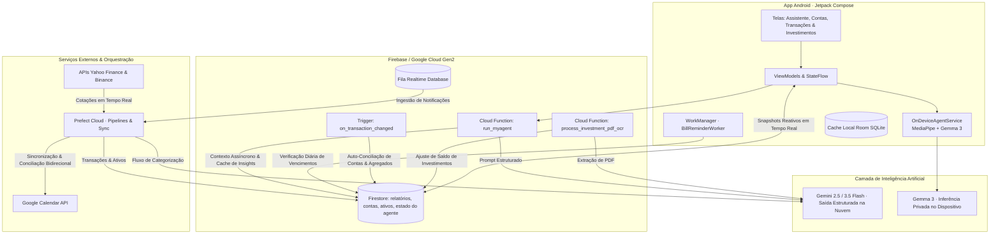
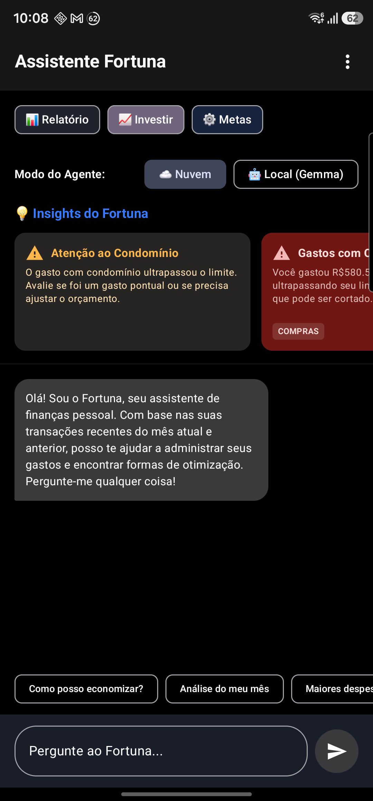
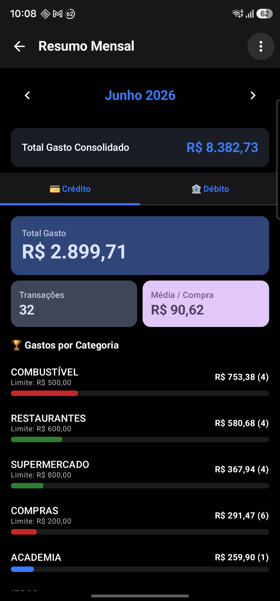
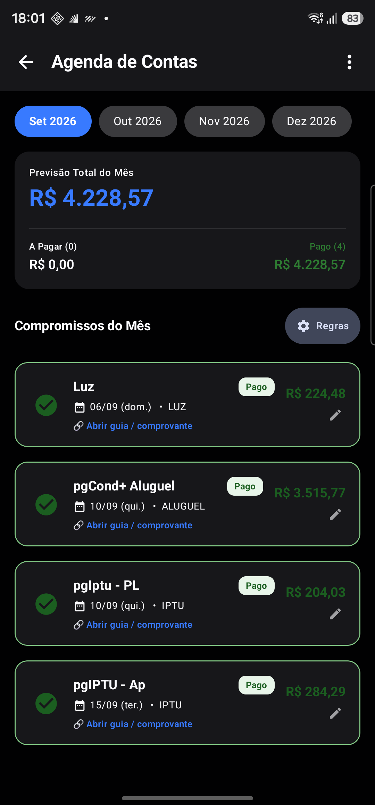
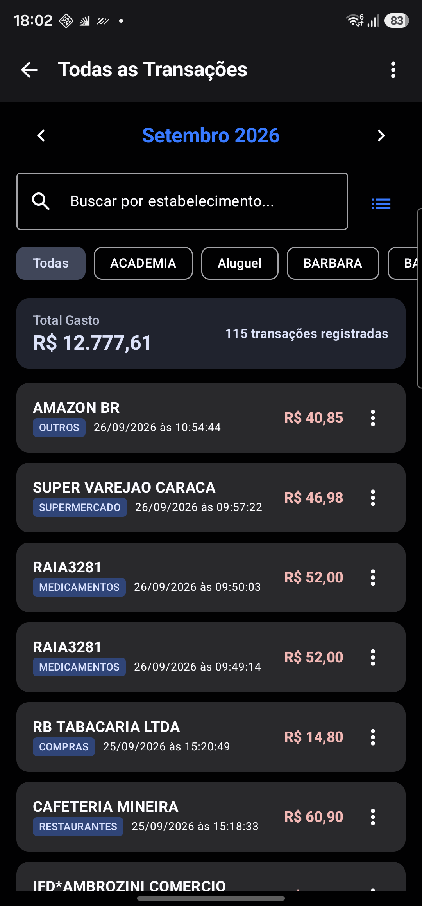
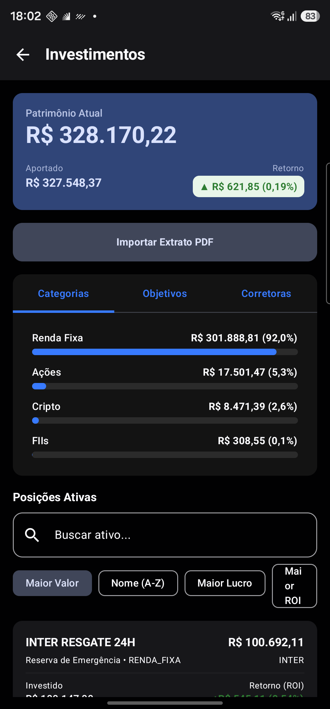
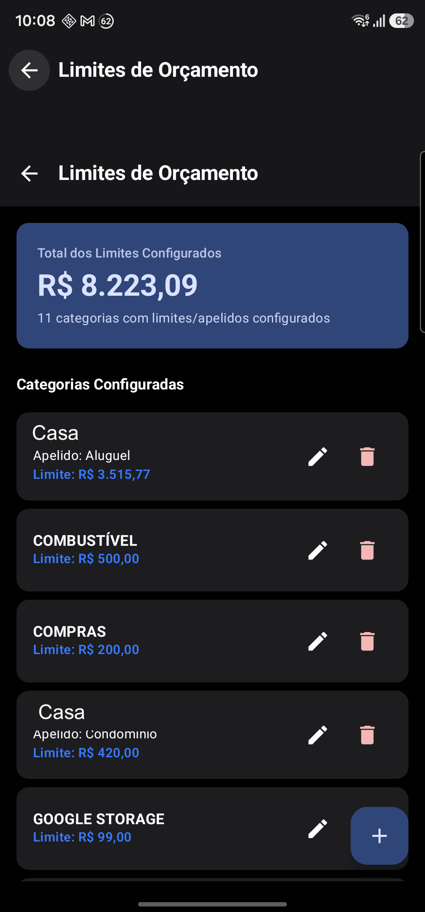
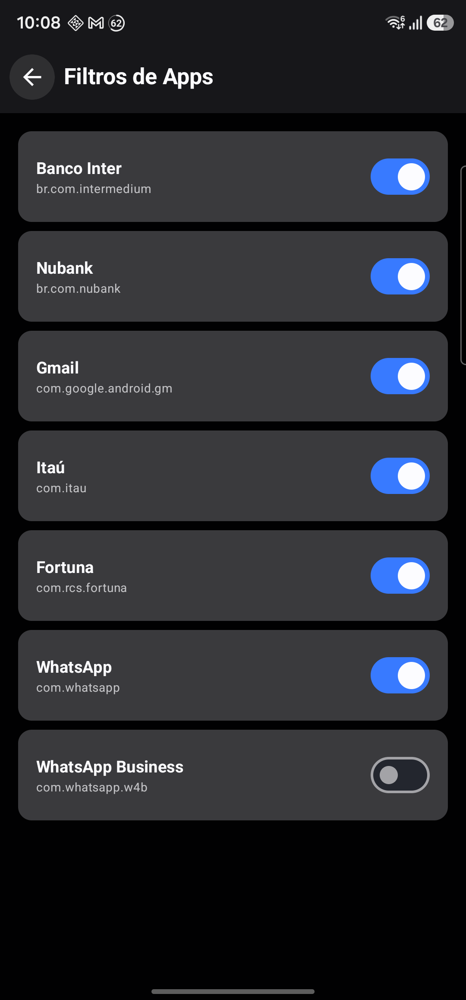
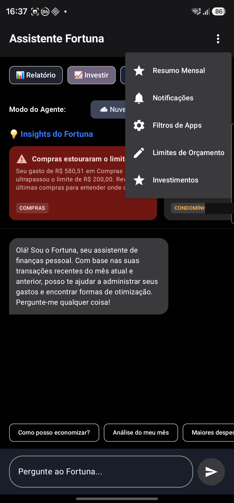

# Fortuna — Ecossistema Financeiro com IA Híbrida (Nuvem + On-Device)

  <a href="README.md">🇺🇸 English</a> |
  <b>🇧🇷 Português</b>

---

**Estudo de caso.** O Fortuna é um assistente financeiro pessoal e ecossistema de automação que desenvolvi para explorar uma questão crítica na engenharia de sistemas modernos: *o que deve rodar em um LLM na nuvem e o que deve rodar diretamente no próprio dispositivo móvel?* O sistema opera agentes de IA em **ambos os ambientes** — Gemini na nuvem e Gemma localmente no celular via MediaPipe/LiteRT — integrados a um aplicativo Android de nível de produção com pipeline serverless orientada a eventos e rotinas automatizadas de conciliação bancária.

> O código-fonte da aplicação e os dados são privados (gerencia minhas próprias operações financeiras). Este repositório documenta a arquitetura, o design de sistemas e as decisões de engenharia. **Demonstração ao vivo disponível mediante solicitação.**

---

## 💡 Por que este projeto se destaca

A maioria das "aplicações com IA" são apenas invólucros simples ao redor de uma única chamada de API para um LLM. O Fortuna é um **sistema distribuído completo de ponta a ponta**:

- 📱 um **cliente móvel** (Kotlin, Jetpack Compose, Clean Architecture Feature-First, Room SQLite) capaz de alternar dinamicamente o roteamento de prompts entre o modelo local no dispositivo e a nuvem.
- ⚡ um **agente na nuvem (`run_myagent`)** com saídas estruturadas validadas via esquemas Pydantic, agregação assíncrona de contexto financeiro no Firestore e cache de insights proativos.
- 🤖 um **LLM On-Device (Gemma 3)** rodando localmente via MediaPipe para consultas com latência zero, funcionando 100% offline e com total privacidade.
- ⏰ **automação proativa em segundo plano** utilizando o **Android WorkManager** para alertas diários de contas a vencer e fluxos do Prefect para sincronização bidirecional com o **Google Calendar** e conciliação bancária.
- 📊 um **barramento de dados orientado a eventos** que garante consistência transacional nos relatórios do Firestore em menos de 1 segundo após a captura de uma nova transação.
- 📈 um **motor de investimentos e OCR multimodal** que combina extração de relatórios e extratos em PDF com IA generativa (Gemini Flash) e cotações em tempo real (B3 e Cripto).

---

## 🏗️ Arquitetura do Sistema

---

## 🧠 Como Funciona a Camada de IA em Múltiplos Níveis

### 1. Agente na Nuvem (`run_myagent`)
Uma Cloud Function Python (Gen2) compila o histórico dos últimos 2 meses, limites orçamentários por categoria e contas agendadas. Utilizando modelos Pydantic e Structured Outputs do Gemini (`application/json`), ela retorna:
* Resposta textual conversacional tipada.
* Lista de cards de insights proativos e contextuais.
* Detecção automática de intenções e chamadas de ferramentas (ex: registrar aportes de investimentos).
Os insights gerados são salvos em cache em `users/{userId}/agent/state` para carregamento imediato na abertura do app.

### 2. LLM Local no Dispositivo (`OnDeviceAgentService`)
Utilizando o motor `LlmInference` do MediaPipe, o aplicativo Android carrega o modelo quantizado em 4 bits do **Gemma 3** diretamente na memória do smartphone. As análises de orçamento e consultas são processadas localmente na CPU/GPU sem enviar dados financeiros sigilosos para a rede.

### 3. OCR Multimodal de Extratos (`process_investment_pdf_ocr`)
O usuário faz upload de extratos em PDF para o Cloud Storage. A função dispara o Gemini Flash para analisar o documento, extrair transações estruturadas (`APLICACAO`, `RESGATE`, `RENDIMENTO`) e atualizar automaticamente os saldos dos ativos e backups no Google Sheets.

---

## 📱 Telas da Aplicação & Experiência do Usuário (UI/UX)

A interface é construída 100% em **Jetpack Compose** com navegação baseada em pilha declarativa (`AppNavigation.kt`), dividida em 5 pilares funcionais:

### 1. Assistente de IA & Insights (`AgentScreen`)
* **Cards de Insights:** Alertas proativos com recomendações orçamentárias geradas por IA.
* **Seletor de Modo de Inferência:** Permite alternar instantaneamente entre processamento On-Device (Gemma offline) e Nuvem (Gemini).
* **Interface Conversacional:** Histórico de chat com respostas estruturadas e renderização de sugestões rápidas.

### 2. Gestão de Contas a Pagar & Conciliação (`BillsScreen`)
* **Visão de Contas:** Separação visual entre contas *Pendentes* e *Pagas* sincronizadas do Google Calendar (`scheduled_bills`).
* **Regras de Auto-Conciliação:** Interface para criar e gerenciar mapeamentos de regex/termos (`bill_mappings`) que associam despesas bancárias a contas da agenda.
* **Lembretes via WorkManager:** Notificações locais diárias de contas prestes a vencer.

### 3. Análise de Gastos e Histórico Detalhado
* **Resumo Mensal (`MonthlyReportScreen`):** Indicadores de fluxo de caixa, total gasto, ticket médio e gráfico de despesas por categoria.
* **Todas as Transações do Mês (`MonthlyTransactionsScreen`):** Lista tabular de todos os lançamentos do mês, com campo de busca em tempo real por estabelecimento e ordenação cronológica.
* **Detalhamento por Categoria (`CategoryTransactionsScreen`):** Drill-down detalhado exibindo todas as compras individuais de uma categoria específica.

### 4. Carteira de Investimentos & OCR (`InvestmentScreen`)
* **Distribuição do Portfólio:** Visão consolidada de patrimônio (Renda Fixa, Ações B3, FIIs e Criptomoedas).
* **Metas Financeiras:** Acompanhamento de objetivos de curto, médio e longo prazo.
* **OCR de Extratos:** Botão para envio de PDFs de corretoras com extração automática via Gemini Flash.

### 5. Configurações e Governança de Dados
* **Limites Orçamentários (`BudgetLimitsScreen`):** Definição de limites de gastos por categoria que alimentam as análises do agente de IA.
* **Histórico de Pushes (`NotificationListScreen`):** Stream de notificações capturadas com status de sincronização (`synced`).
* **Filtros de Aplicativos (`FilterListScreen`):** Controle granular de quais apps bancários são monitorados pelo `NotificationListenerService`.

---

## 🖼️ Galeria de Telas

> Capturas de tela da versão em produção rodando com dados reais (dados identificáveis de terceiros foram ofuscados).

| Home do Assistente (IA) | Resumo Mensal & Agregados | Agenda & Contas a Pagar |
|---|---|---|
|  |  |  |
| Cards de insights + toggle Nuvem/On-Device | Gastos por categoria em tempo real | Contas sincronizadas e regras de conciliação |

| Todas as Transações do Mês | Carteira de Investimentos | Limites Orçamentários |
|---|---|---|
|  |  |  |
| Busca por estabelecimento e ordenação | Posição consolidada e OCR de extratos | Tetos de gastos dinâmicos para a IA |

| Ingestão de Notificações & Filtros | Menu Central do Assistente |
|---|---|
|  |  |
| Aplicativos bancários monitorados | Navegação central e configuração do assistente |

---

## ⚙️ Principais Decisões de Engenharia

* **Design Híbrido (Edge + Cloud):** Tarefas analíticas pesadas e OCR ficam na nuvem; consultas privadas com baixa latência e notificações diárias rodam no próprio cliente móvel.
* **Spec-Driven Development (SDD):** Modelos NoSQL do Firestore, estruturas de coleção e heurísticas de conciliação são especificados em um documento formal como Fonte Única da Verdade (SSOT).
* **Conciliação Automatizada de Extratos e Agenda:** Débitos em conta corrente são cruzados contra eventos da agenda Google via tolerância de datas e matching difuso de nomes, marcando automaticamente as contas como `[PAGO]` no Google Calendar.
* **Testes Herméticos End-to-End (E2E):** Atualizações do backend e dos fluxos do Prefect são validadas em ambiente local emulado (`Firebase Emulator + Prefect Server`) antes da publicação em produção.
* **IDs Determinísticos por Hash MD5:** Transações usam hash MD5 composto por `data + hora + valor + estabelecimento` para garantir idempotência e evitar lançamentos duplicados em caso de retentativas.

---

## 🛠️ Stack Tecnológica

* **Mobile (Android):** Kotlin, Jetpack Compose, Clean Architecture (Feature-First), Room (SQLite), WorkManager, MediaPipe GenAI / LiteRT, Gemma 3.
* **Backend & Cloud Functions:** Python 3.12, Google Cloud Functions (Gen2 / Cloud Run), Firebase Admin SDK, Pydantic, Gemini Flash.
* **Orquestração & Pipelines de Dados:** Prefect Cloud / Server, Google Calendar API, Google Sheets API (`gspread`), `yfinance`, Binance API.
* **Bancos de Dados:** Cloud Firestore (NoSQL transacional), Firebase Realtime Database (fila de mensagens em tempo real).

---

## 🎥 Demonstração e Contato

Vídeo de demonstração técnica disponível cobrindo:
* Interceptação de notificações e consolidação transacional no Firestore.
* Alternância dinâmica entre **Gemini na Nuvem** e **Gemma 3 On-Device**.
* Gestão de contas agendadas com lembretes locais em background (WorkManager).

*Disponível mediante solicitação — conecte-se comigo no [LinkedIn](https://www.linkedin.com/in/rogeriocs/).*

---

*Desenvolvido por [Rogério Celestino](https://rogerioc.github.io/about/) — Engenheiro de Software Sênior especializado em Inteligência Artificial Aplicada e Sistemas Distribuídos.*
